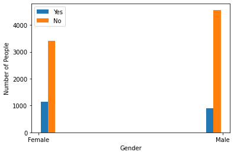
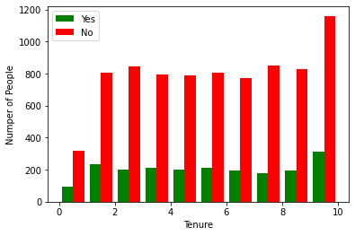
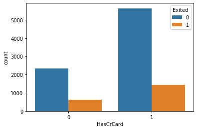
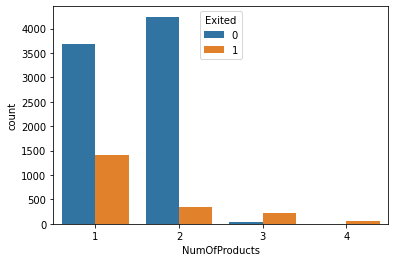

# Attritor Checker

Customers who will be showing attrition are called here as `attritors`. User demographic features and some numerical features like balance, salary are used to predict whether these features has impact on customer attrition or not. 


## Exploratory Data Analysis
 
 

## Dataset
Bank dataset from Kaggle is used. More information and download link can be found [here](https://www.kaggle.com/datasets/barelydedicated/bank-customer-churn-modeling).

## Model Metrics

Used multiple machine learning models and also a artificial neuron network to create the different attrition models.


| Algorithm | Accuracy     | Recall                 |
| :-------- | :------- | :------------------------- |
| Logistic Regression | 81% | 20% |
| Decision Trees | 84% | 40% |
| Support Vector Classifier | 82% | 14% |
| Random Forest | 86% | 44% |
| ANN | 84% | 57% |


We can see even though best accuracy is achieved by Random Forest, but best recall is achieved by Artificial Neuron Network model.


## Installation
1. Clone this repository in your local system
2. Run: ``` pip install -r requirements.txt ```

## Run
1. Make sure you have jupyter notebook installed
2. Go to the project directory and run ``` jupyter notebook ```
